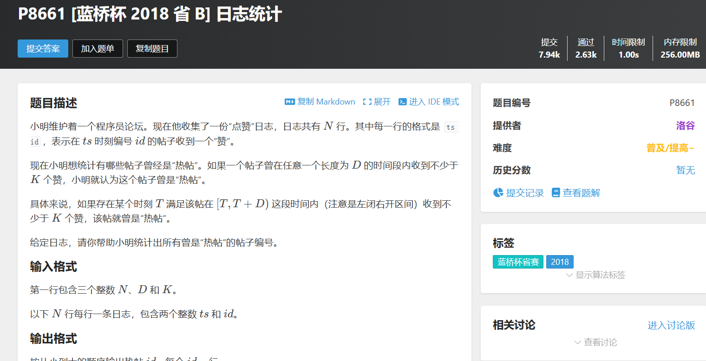

# [P8661 [蓝桥杯 2018 省 B] 日志统计](https://www.luogu.com.cn/problem/P8661)



## 算法思路
需要建立一个字典`unorder_map`来存放每个`id`对应的时间戳
然后对于每个`id`将他的时间戳从小到大排序，然后维护一个长度为`D`的窗口
判断进窗的次数有没有达到`k`次即可。

## code
```cpp
#include <bits/stdc++.h>
using namespace std;
// #define int long long
// const int N = ;
int n, d, k;
void solve()
{
    cin >> n >> d >> k;
    unordered_map<int, vector<int>> logs;
    set<int> ids;
    for (int i = 1; i <= n; i++)
    {
        int ts, id;
        cin >> ts >> id;
        ids.insert(id);
        logs[id].push_back(ts);
    }

    vector<int> res;

    // 对于每个id进行统计
    for (int id : ids)
    {
        auto &tsList = logs[id];
        int cnt = 0, left = 0;
        bool flag = false;

        sort(tsList.begin(), tsList.end());
        
        
        for (int i = 0; i < tsList.size(); i++)
        {
            cnt++;
            while (tsList[i] - tsList[left] >= d)
            {
                cnt--;
                left++;
            }
            if (cnt >= k)
            {
               flag = true;
                break;
            }
        }
        if (flag)
            res.push_back(id);
    }
    sort(res.begin(), res.end());
    for (auto id : res)
    {
        cout << id << "\n";
    }
}
signed main()
{
    ios::sync_with_stdio(false), cin.tie(0), cout.tie(0);
    solve();
    return 0;
}

```